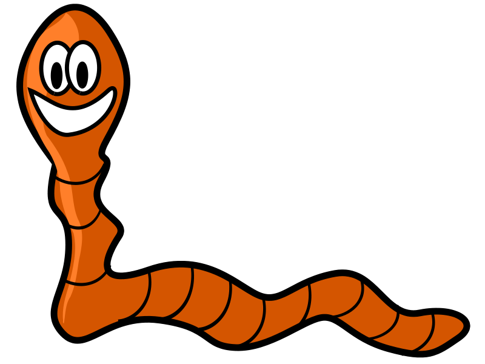

## About the site
This is a personal list where I post anything and everything I feel like writing about. I'm a graduate student, my research is on genome evolution, hence the name of the blog is what it is. I also really like the culture of open source, and the Unix philosophy. I'm just a fan of them, I'm not willing to die on that hill, [so I'm okay reading about people complaining about either of these](https://newcome.wordpress.com/2012/03/06/functional-programming-and-the-death-of-the-unix-way/). 

## What's TTAGGC?
TTAGGC is the most common telomere repeat found in the nematode *Caenorhabditis elegans*.  Telomeres are (usually) the ends of the chromosomes (the DNA). 

